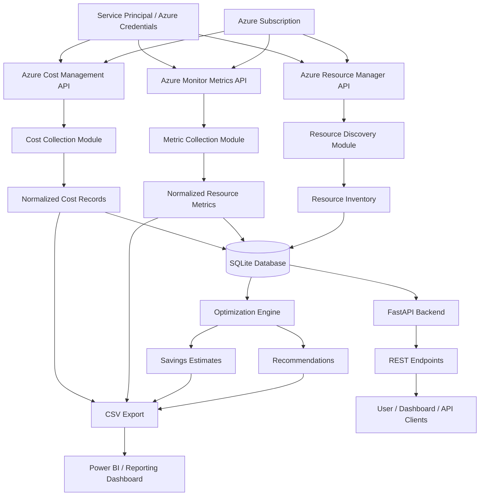

# Cloud Cost Optimization System - Data Flow Diagram



## Flow Description

1. Azure credentials authenticate the application using a service principal.
2. Azure Resource Manager lists all resources inside the subscription.
3. Azure Monitor Metrics API retrieves CPU, storage, and other performance data.
4. Azure Cost Management API retrieves cost information for the subscription.
5. The collector modules normalize the raw responses into structured rows.
6. Data is stored in SQLite tables such as resource_metrics, cost_records, recommendations, and savings_estimates.
7. The optimization engine reads the latest data and generates recommendations and estimated savings.
8. Export scripts generate CSV files used for reporting, dashboards, and further analysis.
9. The FastAPI backend exposes endpoints to access the processed data.

## Main Components

- Azure Subscription: source of resources, metrics, and billing data
- Resource Discovery: identifies Azure services and resources
- Metric Collection: gathers utilization data for compute/storage resources
- Cost Collection: fetches Azure billing data
- Persistence Layer: stores structured data in SQLite
- Optimization Engine: applies rules to detect inefficiencies and estimate savings
- Reporting Layer: exports CSV files for visualization and analytics
- API Layer: exposes the project data through FastAPI endpoints
```
